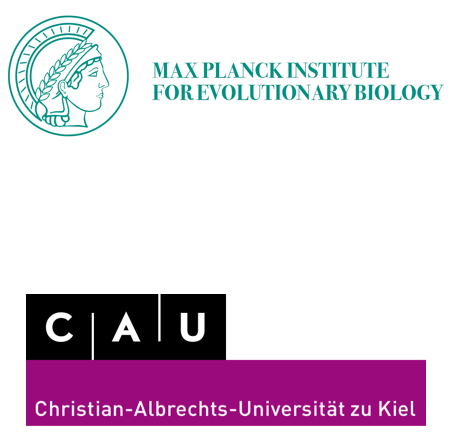



 

Research experience
======

  <!-- Left column -->
  

    

      <b>Postdoctoral Researcher</b>, Max Planck Institute for Evolutionary Biology, Germany
    

    
<i>Microbiota-Specific T Cell Responses in Pemphigoid Diseases</i>

    <ul style="margin: 0; padding-left: 30px; font-size: 0.9em;">
      <li>Researched the role of skin microbiota in autoimmune disease progression</li>
      <li>Identified microbial patterns linked to immune system dysregulation</li>
      <li>Applied high-throughput sequencing and bioinformatics for microbial profiling</li>
      <li>Provided insights to support biomarker discovery and therapeutic strategies</li>
    </ul>
  

  
  <!-- Right column -->
  

    
2024–

    
  

  <!-- Left column -->
  

    

      <b>Doctoral Researcher</b>, Max Planck Institute for Evolutionary Biology, Germany
    

    
<i>Influence of Host Genetics on Gut Microbiota and Antibiotic Response</i>

    <ul style="margin: 0; padding-left: 30px; font-size: 0.9em;">
      <li>Investigated the impact of host genetics on gut microbiota composition and infection resistance</li>
      <li>Analyzed microbiome recovery post-antibiotic treatment using advanced sequencing methods</li>
      <li>Identified genetic factors influencing microbial diversity and recovery</li>
      <li>Contributed to insights on host-microbiome interactions for therapeutic applications</li>
    </ul>
  

  
  <!-- Right column -->
  

    
2019–2024

    
  

 

Education
======

  <!-- Left column -->
  

    

      <b>PhD in Biology</b>, Max Planck Institute for Evolutionary Biology and Kiel University, Germany
    

    <ul style="margin: 0; padding-left: 30px; font-size: 0.9em;">
      <li>
        <b>Dissertation:</b> The role of <em>B4galnt2</em> in shaping the outcome of antibiotic treatment and susceptibility to enteric pathogens
        
          [<a href="https://d-nb.info/1342899571" target="_blank">Deutsche Nationalbibliothek</a>]
          [<a href="https://hdl.handle.net/21.11116/0000-000F-F017-8" target="_blank">Max Planck Society</a>]
          [<a href="https://macau.uni-kiel.de/receive/macau_mods_00005252" target="_blank">University of Kiel</a>]
          [<a href="../files/Cepic_Aleksa_Dissertation.pdf" target="_blank">PDF</a>]
        
      </li>
      <li><b>Supervisor:</b> <a href="https://www.evolbio.mpg.de/person/11969/16329" target="_blank">John F. Baines</a></li>
    </ul>
  

  
  <!-- Right column -->
  

    
2019–2024

    
  

  <!-- Left column -->
  

    

      <b>BSc & MSc in Biology</b>, University of Belgrade, Serbia
    

  

  
  <!-- Right column -->
  

    
2011–2017

    
  

 

Conferences
======

  

    <!-- First column with two paragraphs -->
    
CRC1526: Pathomechanisms of Antibody-mediated Autoimmunity Retreat  Berlin, Germany - Oral presentation

  

  

    <!-- Second column with one paragraph -->
    
14-15 Nov 2024

  

  

    <!-- First column with two paragraphs -->
    
International Max Planck Research School for Evolutionary Biology Retreat  Kiel, Germany - Oral presentation

  

  

    <!-- Second column with one paragraph -->
    
16-17 Sep 2021

  

  

    <!-- First column with two paragraphs -->
    
Aquavit 2021  Plön, Germany - Oral presentation

  

  

    <!-- Second column with one paragraph -->
    
17-18 Jun 2021

  

  

    <!-- First column with two paragraphs -->
    
International Max Planck Research School for Evolutionary Biology Retreat  Plön, Germany - Video presentation

  

  

    <!-- Second column with one paragraph -->
    
17-18 Sep 2020

  

  

    <!-- First column with two paragraphs -->
    
International Max Planck Research School for Evolutionary Biology Retreat  Oeversee, Germany - Poster presentation

  

  

    <!-- Second column with one paragraph -->
    
11-13 Sep 2019

  

  

    <!-- First column with two paragraphs -->
    
Microbiota, Probiotics and Host, 12th Seeon Conference  Seeon, Germany - Poster presentation

  

  

    <!-- Second column with one paragraph -->
    
28-30 Jun 2019

  

 

Professional Memberships
======

- International Society for Evolution, Medicine, and Public Health (ISEMPH)
- European Society of Clinical Microbiology and Infectious Diseases (ESCMID)

 

